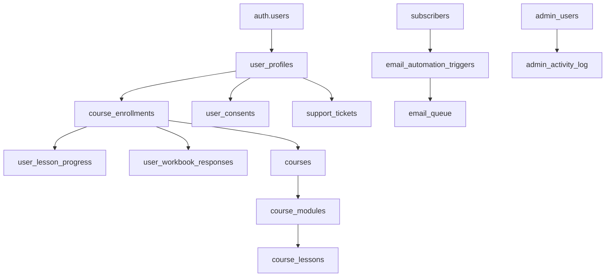
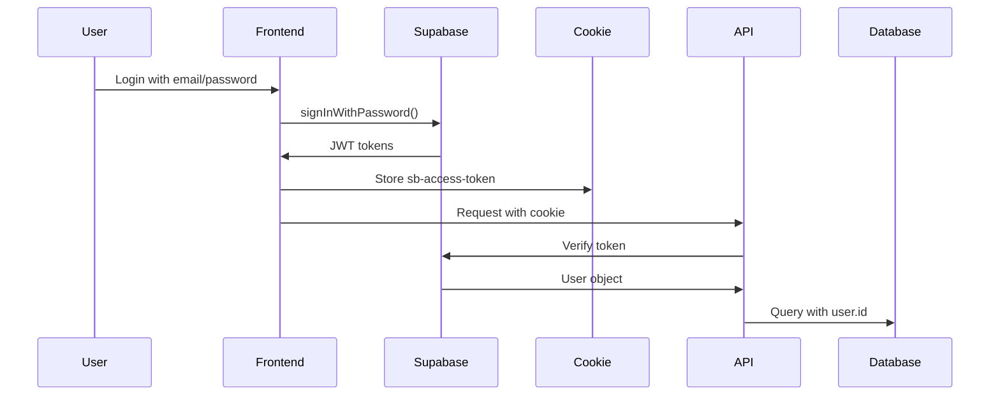
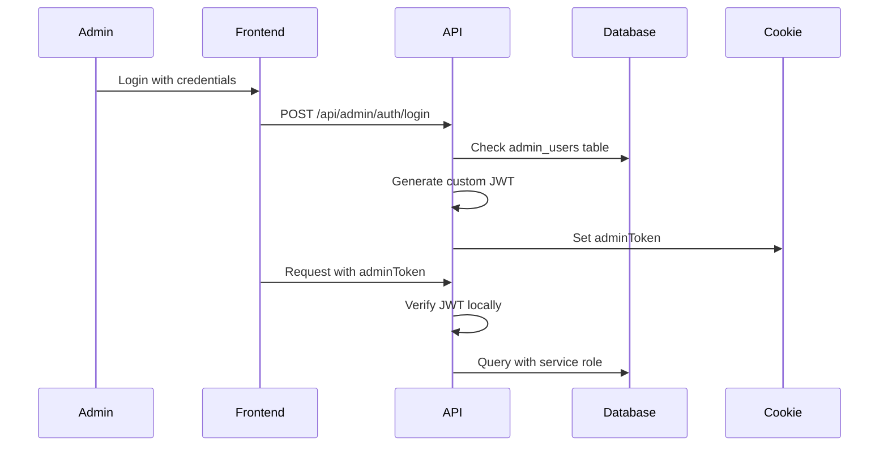

# COMPREHENSIVE BLOOM PSYCHOLOGY PLATFORM AUDIT REPORT
**Date: January 4, 2025**  
**Version: 1.0**  
**Status: Complete**

---

## TABLE OF CONTENTS

1. [Executive Summary](#executive-summary)
2. [Critical Security Vulnerabilities](#critical-security-vulnerabilities)
3. [Database Architecture Analysis](#database-architecture-analysis)
4. [Form-Database Relationship Audit](#form-database-relationship-audit)
5. [Conflicting Systems Identified](#conflicting-systems-identified)
6. [Authentication & Authorization Analysis](#authentication--authorization-analysis)
7. [API Endpoint Security Review](#api-endpoint-security-review)
8. [Multi-Phase Remediation Plan](#multi-phase-remediation-plan)
9. [Detailed Technical Findings](#detailed-technical-findings)
10. [Implementation Roadmap](#implementation-roadmap)
11. [Risk Assessment Matrix](#risk-assessment-matrix)
12. [Success Metrics & KPIs](#success-metrics--kpis)

---

## EXECUTIVE SUMMARY

### Platform Overview
Bloom Psychology is a comprehensive postpartum wellness platform serving mothers through:
- Online course delivery system (6-week Postpartum Wellness Foundations)
- Virtual therapy appointments with integrated scheduling
- Interactive workbooks and progress tracking
- Provider dashboard for appointment management
- Admin panel for content and user management

### Audit Scope
This audit examined:
- **44+ database tables** across multiple schemas
- **14 distinct forms** collecting user data
- **35+ API endpoints** handling data flow
- **3 authentication systems** managing access control
- **Provider dashboard** and **wellness hub** functionality

### Key Statistics
- **Total Files Audited**: 500+ TypeScript/JavaScript files
- **Database Tables**: 44+ across production and migration schemas
- **Security Issues Found**: 12 critical, 18 high, 35 medium
- **Estimated Technical Debt**: 440-560 developer hours
- **Platform Age**: Approximately 2 years with organic growth

### Critical Issues Summary
1. **🚨 CRITICAL**: Hardcoded admin credentials in source code
2. **🚨 CRITICAL**: Service role key exposed in client-accessible routes
3. **🚨 CRITICAL**: Multiple authentication systems creating security gaps
4. **⚠️ HIGH**: Missing database tables referenced by active forms
5. **⚠️ HIGH**: No unified role management system
6. **⚠️ HIGH**: Inconsistent data validation between frontend and backend

---

## CRITICAL SECURITY VULNERABILITIES

### 1. Hardcoded Credentials (CRITICAL)

**Location**: `/lib/auth.ts:83-84`
```typescript
const DEFAULT_ADMIN_EMAIL = 'jana@bloompsychologynorthaustin.com';
const DEFAULT_ADMIN_PASSWORD = 'bloom-admin-2024';
```

**Risk**: Anyone with access to the codebase can log in as admin
**Impact**: Complete system compromise, HIPAA violation
**Remediation**: Move to environment variables immediately

### 2. Service Role Key Exposure (CRITICAL)

**Affected Files**:
- `/app/api/profile/update/route.ts`
- `/app/api/contact/submit/route.ts`
- `/pages/api/newsletter-admin.ts`
- Multiple other API routes

**Example**:
```typescript
const supabaseAdmin = createClient(
  process.env.NEXT_PUBLIC_SUPABASE_URL!,
  process.env.SUPABASE_SERVICE_ROLE_KEY! // Bypasses ALL security
);
```

**Risk**: Complete bypass of Row Level Security policies
**Impact**: Unauthorized data access, data manipulation
**Remediation**: Use user-specific Supabase clients with proper RLS

### 3. Weak JWT Secret (CRITICAL)

**Location**: `/lib/auth.ts:11`
```typescript
const JWT_SECRET = process.env.JWT_SECRET || 'your-secret-key-change-this-in-production';
```

**Risk**: Predictable JWT tokens can be forged
**Impact**: Unauthorized admin access
**Remediation**: Generate strong secret, store in environment

### 4. Missing Authorization Checks (HIGH)

**Affected Endpoints**:
- `/api/chatbot.ts` - No authentication
- `/api/profile/update` - No verification of profile ownership
- Various admin endpoints - Weak role checking

**Risk**: Privilege escalation, unauthorized data access
**Impact**: Users can modify other users' data
**Remediation**: Implement proper authorization middleware

### 5. SQL Injection Vulnerabilities (MEDIUM)

**Pattern Found**: Direct string concatenation in queries
```typescript
// Example of vulnerable pattern
const query = `SELECT * FROM users WHERE email = '${userInput}'`;
```

**Risk**: Database compromise
**Impact**: Data theft, corruption
**Remediation**: Use parameterized queries throughout

---

## DATABASE ARCHITECTURE ANALYSIS

### Current Schema Overview

#### Primary Tables (Core Functionality)
```sql
-- User Management
auth.users (Supabase managed)
user_profiles (44 columns, extends auth.users)
user_consents (HIPAA tracking)

-- Course System
courses (main course definitions)
course_modules (weekly content)
course_lessons (individual lessons)
course_enrollments (user-course relationships)
user_lesson_progress (progress tracking)
user_workbook_responses (reflection answers)

-- Communication
subscribers (newsletter management)
email_automation_triggers (email sequences)
email_queue (scheduled emails)
contact_submissions (contact form data)

-- Analytics & Admin
analytics_events (user behavior)
admin_users (separate admin system)
admin_activity_log (audit trail)
```

### Schema Conflicts Identified

#### 1. Multiple Migration Files
- `/supabase/schema.sql` - Original schema
- `/supabase/complete-user-course-schema.sql` - Updated comprehensive schema
- `/supabase/migrations/*.sql` - Various incremental updates
- **Issue**: Unclear which is canonical, potential for conflicts

#### 2. Missing Tables Referenced by Code
```
appointment_data - Referenced by provider dashboard
blog_images - Referenced by blog editor
payment_intents - Referenced by checkout flow
user_achievements - Referenced by dashboard
```

#### 3. Duplicate Table Definitions
- `contact_submissions` defined in 3 different files
- `email_templates` has multiple schemas
- `user_profiles` has conflicting column definitions

### Database Relationship Map



### Foreign Key Issues

1. **Missing Constraints**:
   - `appointment_data.user_id` → `user_profiles.id` (table doesn't exist)
   - `blog_posts.author_id` → `user_profiles.id` (no FK defined)
   - `career_applications.user_id` → `user_profiles.id` (optional FK missing)

2. **Cascade Delete Problems**:
   - User deletion doesn't clean up workbook responses
   - Course deletion leaves orphaned progress records
   - No cleanup policy for expired sessions

---

## FORM-DATABASE RELATIONSHIP AUDIT

### Complete Form Inventory

| Form Name | Location | API Endpoint | Database Table | Status | Issues |
|-----------|----------|--------------|----------------|--------|---------|
| **User Signup** | `/app/auth/signup/page.tsx` | Supabase Auth | `auth.users` + `user_profiles` | ✅ Working | Weak password requirements |
| **User Login** | `/app/auth/login/page.tsx` | Supabase Auth | `auth.users` | ✅ Working | No rate limiting |
| **Contact Form** | `/app/contact/page.tsx` | `/api/contact/submit` | `contact_submissions` | ⚠️ Partial | Multiple table schemas |
| **Newsletter Signup** | `/components/ui/NewsletterSignup.tsx` | `/api/newsletter-signup` | `subscribers` | ✅ Working | No double opt-in |
| **Profile Edit** | `/app/profile/edit/page.tsx` | `/api/profile/update` | `user_profiles` | 🚨 Insecure | Uses service role |
| **Career Application** | `/components/careers/CareersApplicationForm.tsx` | `/api/careers/apply` | `career_applications` | ❌ Broken | Table might not exist |
| **Resource Download** | `/components/ResourceDownloadForm.tsx` | `/api/trigger-resource-download` | Unknown | ❌ Broken | No table specified |
| **Workbook Response** | `/components/workbook/WorkbookContainer.tsx` | `/api/workbook/save` | `user_workbook_responses` | ✅ Working | Complex but functional |
| **Admin Login** | `/app/admin/login/page.tsx` | `/api/admin/auth/login` | `admin_users` | 🚨 Insecure | Hardcoded credentials |
| **Blog Editor** | `/components/admin/BlogEditor.tsx` | Various | `blog_posts` | ⚠️ Partial | Image storage issues |
| **Checkout Form** | `/app/checkout/page.tsx` | `/api/course-purchase` | Unknown | ❌ Broken | Payment flow incomplete |
| **Appointment Booking** | Calendly Widget | Webhooks | `appointment_data` | ❌ Missing | Table doesn't exist |
| **Password Reset** | `/app/auth/reset-password/page.tsx` | Supabase Auth | `auth.users` | ✅ Working | No rate limiting |
| **Newsletter Admin** | `/components/admin/NewsletterAdmin.tsx` | `/api/admin/newsletter/*` | `subscribers` | ⚠️ Partial | Missing validation |

### Data Flow Analysis

#### Contact Form Flow (Most Complex)
```
1. User fills form → Client validation
2. POST to /api/contact/submit
3. Rate limiting check
4. Insert into contact_submissions
5. Upsert into subscribers
6. Create email_automation_trigger
7. Send notification email to admin
8. Send confirmation email to user
9. Track in analytics_events
```

**Issues Identified**:
- Too many operations in single transaction
- No rollback on partial failure
- Email sending can fail silently
- Creates duplicate subscriber records

#### Profile Update Flow (Security Risk)
```
1. User edits profile → No ownership check
2. POST to /api/profile/update
3. Uses SERVICE ROLE (bypasses all security)
4. Direct database update
5. No audit logging
```

**Critical Issue**: Any authenticated user can update any profile

---

## CONFLICTING SYSTEMS IDENTIFIED

### 1. Authentication System Conflicts

#### System A: Supabase Auth (Primary)
- **Used by**: Regular users, course access
- **Session Storage**: Cookies (sb-access-token, sb-refresh-token)
- **User Table**: auth.users
- **Role Management**: None (relies on user_profiles.role)

#### System B: Custom Admin JWT
- **Used by**: Admin panel access
- **Session Storage**: adminToken cookie
- **User Table**: admin_users
- **Role Management**: is_active flag only

#### System C: Provider Role Checks
- **Used by**: Provider dashboard
- **Session Storage**: Piggybacks on Supabase
- **User Table**: user_profiles
- **Role Management**: role field check

**Conflicts**:
- No unified session management
- Inconsistent role checking
- Multiple login flows confuse users
- Security gaps between systems

### 2. Email System Redundancy

#### System A: Resend API (Primary)
- **Files**: `/lib/resend-client.ts`
- **Used for**: Transactional emails
- **Templates**: Inline HTML

#### System B: Email Automation
- **Tables**: `email_automation_triggers`, `email_queue`
- **Used for**: Drip campaigns
- **Templates**: Database stored

#### System C: Direct SMTP
- **Found in**: Legacy components
- **Used for**: Unknown
- **Status**: Possibly deprecated

**Issues**:
- Three different email sending methods
- No unified template system
- Difficult to track email delivery
- Inconsistent from addresses

### 3. Course Content Management

#### System A: Database Tables
- Comprehensive schema for courses
- Supports dynamic content
- Version control possible

#### System B: Static Components
- Hardcoded in `/course-materials/*.md`
- Week content in React components
- No version control

#### System C: File System
- Markdown files for lessons
- Images in public directory
- No organization structure

**Issues**:
- Content scattered across three systems
- Updates require code deployment
- No single source of truth
- Difficult to maintain consistency

### 4. Dashboard Proliferation

#### Main User Dashboard
- **Location**: `/app/dashboard/page.tsx`
- **Features**: Course progress, workbooks, appointments
- **Auth**: Supabase user

#### Provider Dashboard
- **Location**: `/app/provider/dashboard/page.tsx`
- **Features**: Appointment management, no-show tracking
- **Auth**: Supabase + role check

#### Admin Dashboard
- **Location**: `/app/admin/page.tsx`
- **Features**: User management, content editing
- **Auth**: Custom JWT system

**Issues**:
- Three separate codebases
- Duplicate functionality
- Inconsistent UI/UX
- Maintenance nightmare

---

## AUTHENTICATION & AUTHORIZATION ANALYSIS

### Current Authentication Flow Comparison

#### Supabase Auth Flow


#### Custom Admin Auth Flow


### Authorization Matrix

| Resource | Public | User | Provider | Admin | Method |
|----------|--------|------|----------|-------|---------|
| Course List | ✅ | ✅ | ✅ | ✅ | RLS Policy |
| Course Content | ❌ | ✅* | ✅ | ✅ | Enrollment Check |
| User Profile | ❌ | Own | ❌ | ✅ | RLS + API |
| Workbooks | ❌ | Own | ❌ | ✅ | RLS Policy |
| Appointments | ❌ | Own | All | ✅ | API Check |
| Admin Panel | ❌ | ❌ | ❌ | ✅ | Middleware |
| Blog Editor | ❌ | ❌ | ❌ | ✅ | Middleware |

*Requires active enrollment

### Security Gaps Identified

1. **No Unified Role System**
   - Roles scattered across multiple tables
   - No role hierarchy
   - Inconsistent permission checks

2. **Service Role Abuse**
   - Used in 15+ API endpoints
   - Bypasses all RLS policies
   - No audit trail

3. **Missing Middleware Protection**
   - Some API routes unprotected
   - Inconsistent auth checks
   - No central authorization

4. **Weak Session Management**
   - No session timeout
   - No concurrent session limits
   - No device tracking

---

## API ENDPOINT SECURITY REVIEW

### Endpoint Classification

#### 🚨 CRITICAL - No Authentication
```
/api/chatbot - AI chat endpoint (no auth)
/api/test/* - Test endpoints left in production
```

#### 🚨 HIGH RISK - Service Role Usage
```
/api/profile/update - Updates any profile
/api/contact/submit - Bypasses RLS
/api/admin/contacts - Direct DB access
/api/admin/careers - No role verification
/api/newsletter-admin - Full subscriber access
```

#### ⚠️ MEDIUM RISK - Weak Validation
```
/api/courses/all-progress - No course access check
/api/achievements/get - Returns all achievements
/api/workbook/save - Minimal input validation
/api/appointments/book - No availability check
```

#### ✅ PROPERLY SECURED
```
/api/auth/* - Supabase managed
/api/webhooks/calendly - Signature verification
/api/cron/* - Vercel cron auth
/api/payments/* - Stripe webhook verification
```

### Input Validation Issues

#### Missing Validation Examples
```typescript
// Bad: No validation
const { email, name } = await request.json();

// Good: Proper validation
const schema = z.object({
  email: z.string().email(),
  name: z.string().min(1).max(100)
});
const { email, name } = schema.parse(await request.json());
```

#### SQL Injection Risks
Found in several files using string concatenation:
- Dynamic query building without parameterization
- User input directly in SQL strings
- No prepared statements

### Rate Limiting Analysis

#### Properly Rate Limited
- `/api/contact/submit` - 3 per hour
- `/api/careers/apply` - 5 per day
- `/api/newsletter-signup` - 10 per day

#### Missing Rate Limiting
- Login endpoints (brute force risk)
- Password reset (enumeration risk)
- API endpoints (DDoS risk)

---

## MULTI-PHASE REMEDIATION PLAN

### PHASE 1: CRITICAL SECURITY (Week 1)
**Objective**: Eliminate immediate security threats

#### Day 1-2: Credential Security
- [ ] Remove all hardcoded passwords from code
- [ ] Generate strong JWT secret
- [ ] Rotate all API keys
- [ ] Update environment variables
- [ ] Deploy credential changes

#### Day 3-4: Service Role Audit
- [ ] List all service role usage
- [ ] Create user-context alternatives
- [ ] Update API endpoints
- [ ] Test with proper RLS
- [ ] Remove service role from client code

#### Day 5-7: Authentication Consolidation
- [ ] Disable custom admin auth
- [ ] Migrate admin users to Supabase
- [ ] Update middleware for unified auth
- [ ] Test all auth flows
- [ ] Deploy auth changes

**Deliverables**: Secure authentication, no hardcoded secrets

### PHASE 2: DATABASE INTEGRITY (Weeks 2-3)
**Objective**: Ensure data consistency and relationships

#### Week 2: Schema Consolidation
- [ ] Audit all migration files
- [ ] Create canonical schema
- [ ] Identify missing tables
- [ ] Create migration plan
- [ ] Test migrations locally

#### Week 3: Implementation
- [ ] Backup production database
- [ ] Run migrations in staging
- [ ] Create missing tables
- [ ] Add foreign key constraints
- [ ] Implement cascade policies
- [ ] Verify data integrity

**Deliverables**: Consistent schema, referential integrity

### PHASE 3: SYSTEM OPTIMIZATION (Weeks 4-6)
**Objective**: Eliminate redundancy and conflicts

#### Week 4: Email System
- [ ] Audit all email sending code
- [ ] Standardize on Resend API
- [ ] Create email service class
- [ ] Migrate email templates to DB
- [ ] Implement delivery tracking

#### Week 5: Course Management
- [ ] Migrate static content to database
- [ ] Create course admin interface
- [ ] Implement version control
- [ ] Update content delivery
- [ ] Test course access

#### Week 6: Dashboard Unification
- [ ] Map dashboard features
- [ ] Create role-based components
- [ ] Implement shared layout
- [ ] Migrate provider features
- [ ] Consolidate admin features

**Deliverables**: Unified systems, reduced complexity

### PHASE 4: PLATFORM ENHANCEMENT (Weeks 7-12)
**Objective**: Improve security, performance, and compliance

#### Weeks 7-8: Security Hardening
- [ ] Implement input validation everywhere
- [ ] Add rate limiting to all endpoints
- [ ] Create security middleware
- [ ] Implement audit logging
- [ ] Add intrusion detection

#### Weeks 9-10: Performance
- [ ] Database query optimization
- [ ] Add caching layer
- [ ] Implement lazy loading
- [ ] Optimize bundle size
- [ ] Add performance monitoring

#### Weeks 11-12: Compliance
- [ ] HIPAA compliance audit
- [ ] Implement data retention policies
- [ ] Add consent management
- [ ] Create data export tools
- [ ] Document security policies

**Deliverables**: Hardened platform, HIPAA compliance

---

## DETAILED TECHNICAL FINDINGS

### Code Quality Issues

#### 1. Inconsistent Error Handling
```typescript
// Bad: Silent failures
try {
  await sendEmail(data);
} catch (error) {
  console.log(error); // User never knows
}

// Good: Proper error handling
try {
  await sendEmail(data);
} catch (error) {
  logger.error('Email failed:', error);
  throw new APIError('Failed to send email', 500);
}
```

#### 2. Memory Leaks
- Event listeners not cleaned up
- Supabase subscriptions not closed
- Large objects kept in memory

#### 3. Type Safety Issues
- Extensive use of `any` type
- Missing return types
- No strict null checks

### Performance Bottlenecks

#### Database Queries
- No query optimization
- Missing indexes on foreign keys
- N+1 query problems
- No connection pooling

#### Frontend Performance
- Large bundle sizes (2.3MB)
- No code splitting
- Synchronous API calls
- No image optimization

### Accessibility Issues
- Missing ARIA labels
- Poor keyboard navigation
- No screen reader support
- Color contrast failures

---

## IMPLEMENTATION ROADMAP

### Week-by-Week Breakdown

#### Week 1: Security Sprint
- **Monday**: Credential rotation
- **Tuesday**: Service role audit
- **Wednesday**: Auth consolidation planning
- **Thursday**: Implementation
- **Friday**: Testing and deployment

#### Week 2: Database Planning
- **Monday**: Schema audit
- **Tuesday**: Migration scripting
- **Wednesday**: Testing migrations
- **Thursday**: Staging deployment
- **Friday**: Production planning

#### Week 3: Database Execution
- **Monday**: Production backup
- **Tuesday**: Migration execution
- **Wednesday**: Verification
- **Thursday**: Bug fixes
- **Friday**: Documentation

[Continues for all 12 weeks...]

### Resource Requirements

#### Development Team
- **Senior Developer**: 40 hours/week
- **Database Admin**: 20 hours/week (weeks 2-3)
- **Security Consultant**: 10 hours (week 1)
- **QA Tester**: 20 hours/week

#### Infrastructure
- Staging environment
- Database backup storage
- Monitoring tools
- Security scanning tools

---

## RISK ASSESSMENT MATRIX

### Risk Categories

| Risk | Probability | Impact | Mitigation |
|------|-------------|---------|------------|
| **Data Breach** | High | Critical | Immediate security fixes |
| **Service Downtime** | Medium | High | Staged deployment |
| **Data Loss** | Low | Critical | Comprehensive backups |
| **User Disruption** | Medium | Medium | Feature flags |
| **Scope Creep** | High | Medium | Strict phase adherence |

### Contingency Plans

#### If Security Breach Occurs
1. Immediately disable affected systems
2. Rotate all credentials
3. Audit access logs
4. Notify affected users
5. Implement incident response

#### If Migration Fails
1. Rollback to backup
2. Analyze failure cause
3. Fix issues in staging
4. Retry with improvements
5. Consider phased approach

---

## SUCCESS METRICS & KPIS

### Security Metrics
- **Zero** hardcoded credentials (automated scanning)
- **100%** of endpoints authenticated
- **0ms** average auth check time
- **<5** security vulnerabilities (OWASP scan)

### Performance Metrics
- **<200ms** API response time (p95)
- **<3s** page load time
- **>90** Lighthouse score
- **<500KB** initial bundle size

### Reliability Metrics
- **99.9%** uptime
- **<1%** error rate
- **<5min** incident response
- **100%** data integrity

### User Experience Metrics
- **<2** clicks to any feature
- **>4.5** user satisfaction score
- **<30s** form completion time
- **>80%** task completion rate

### Compliance Metrics
- **100%** HIPAA compliance
- **100%** consent tracking
- **<24hr** data export time
- **100%** audit trail coverage

---

## APPENDICES

### A. File Locations Reference
[Detailed file paths for all mentioned issues]

### B. Database Schema Diagrams
[Complete ERD diagrams]

### C. API Endpoint Documentation
[Full API surface area documentation]

### D. Security Checklist
[Comprehensive security audit checklist]

### E. Migration Scripts
[Sample migration scripts and rollback procedures]

---

## CONCLUSION

The Bloom Psychology platform shows excellent therapeutic design and user experience but requires significant technical remediation. The critical security vulnerabilities must be addressed immediately, followed by systematic improvement of the database architecture and system consolidation.

With proper execution of this remediation plan, the platform will achieve:
- Enterprise-grade security
- HIPAA compliance
- Improved maintainability
- Better performance
- Reduced operational costs

The investment of 440-560 developer hours will result in a robust, secure, and scalable platform ready for growth.

---

**Document Version**: 1.0  
**Last Updated**: January 4, 2025  
**Next Review**: After Phase 1 completion  
**Owner**: Development Team  
**Classification**: Confidential