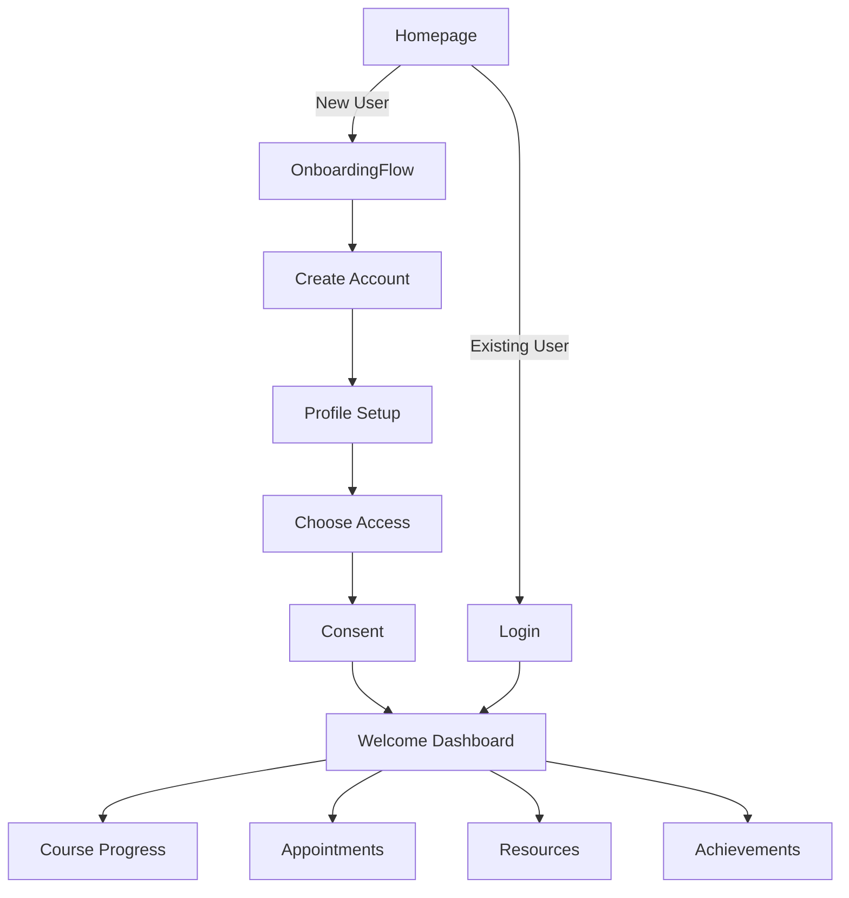

# Platform Consolidation Plan: Unified User Experience

## 🎯 Current State Analysis

### Existing Onboarding Flow (Created Today)
Located in `/components/onboarding/`:
- **Purpose**: Course signup and initial user registration
- **Steps**: Welcome → Account → Profile → Access → Consent → Complete
- **Features**:
  - Account creation with email/password
  - Profile collection (name, maternal health info, emergency contacts)
  - Course/workshop/waitlist selection
  - HIPAA consent collection
  - Source tracking (teaser video, course page, etc.)

### Proposed User Platform (New Plan)
From `BLOOM-USER-PLATFORM-PLAN.md`:
- **Purpose**: Ongoing user engagement and wellness tracking
- **Features**:
  - Wellness dashboard
  - Star/badge achievements
  - Appointment management
  - Progress tracking
  - Resource recommendations

## ✅ Consolidation Strategy

### 1. Unified Architecture

```typescript
interface UnifiedUserJourney {
  entry: {
    newUser: {
      flow: 'Existing OnboardingFlow component',
      destination: 'Wellness Dashboard',
      firstAchievement: 'Welcome Star'
    },
    returningUser: {
      flow: 'Direct to Dashboard',
      quickActions: ['Continue Course', 'Book Appointment', 'Browse Resources']
    }
  }
}
```

### 2. Integration Points

#### A. Onboarding → Dashboard Transition
- **After CompleteStep**: Route to new Wellness Dashboard
- **First-time experience**: Dashboard tour/orientation
- **Data handoff**: OnboardingData → User Profile

#### B. Enhanced Header (Both Flows)
```typescript
// Before login
<Button>Start Your Journey</Button> // → OnboardingFlow

// After login  
<ProfileMenu>
  My Wellness Hub  // → Dashboard
  Courses         // → Existing course pages
  Appointments    // → New appointment hub
  Settings        // → Profile & privacy
</ProfileMenu>
```

#### C. Database Schema Integration
```sql
-- Existing tables (keep as-is)
user_profiles ✓
course_enrollments ✓
user_course_access ✓

-- New additions for platform features
user_achievements (stars/badges)
wellness_entries (mood tracking)
appointment_data (Calendly wrapper)
user_preferences (display settings)
```

### 3. User Flow Mapping



### 4. Component Reuse Strategy

#### Keep & Enhance:
- `OnboardingFlow` - Perfect for new users
- `CourseAuthWrapper` - Protect course content
- All existing course pages

#### Add New:
- `DashboardLayout` - Main user hub
- `AchievementSystem` - Stars/badges
- `AppointmentHub` - Calendly integration
- `WellnessTracker` - Mood/progress

#### Modify:
- `Header` - Add prominent auth/profile section
- `LayoutWrapper` - Support dashboard routes

## 📋 Implementation Plan

### Phase 1: Foundation (Week 1)
1. ✅ Keep existing OnboardingFlow (it's great!)
2. Add "My Wellness Hub" to header
3. Create basic dashboard page at `/dashboard`
4. Update routing after onboarding completion
5. Set up new database tables

### Phase 2: Dashboard Features (Week 2)
1. Build wellness dashboard components
2. Integrate course progress display
3. Add appointment countdown widget
4. Implement first achievements

### Phase 3: Integration (Week 3)
1. Connect OnboardingFlow → Dashboard
2. Add achievement earning to existing flows
3. Implement appointment wrapper
4. Add resource recommendations

### Phase 4: Polish (Week 4)
1. User testing
2. Performance optimization
3. Mobile responsiveness
4. Launch preparation

## 🚫 What NOT to Do

### Avoid Duplication:
- ❌ Don't create a second onboarding flow
- ❌ Don't duplicate profile collection
- ❌ Don't have two login systems

### Keep Simple:
- ❌ Don't over-complicate the dashboard
- ❌ Don't add features without clear value
- ❌ Don't create friction in user flow

## ✨ Key Decisions

1. **Use existing OnboardingFlow** for all new user signups
2. **Route to Dashboard** after onboarding completion
3. **Single source of truth** for user profiles
4. **Progressive enhancement** - add features gradually
5. **Mobile-first** dashboard design

## 🎯 Success Metrics

- Onboarding completion rate
- Dashboard engagement (weekly active users)
- Course progress tracking
- Appointment booking rate
- Star collection engagement

## Next Immediate Steps

1. **Update Header.tsx** with auth buttons
2. **Create /app/dashboard/page.tsx**
3. **Modify OnboardingFlow** to route to dashboard
4. **Add star earning** to onboarding completion
5. **Create database migrations**

---

## Summary

We have a solid onboarding flow already built. The new user platform features (dashboard, achievements, appointment management) complement this perfectly. No need to rebuild - just enhance and connect!

**The Plan**: New users → OnboardingFlow → Dashboard → Ongoing Engagement

This creates a seamless journey from first visit to long-term wellness support.