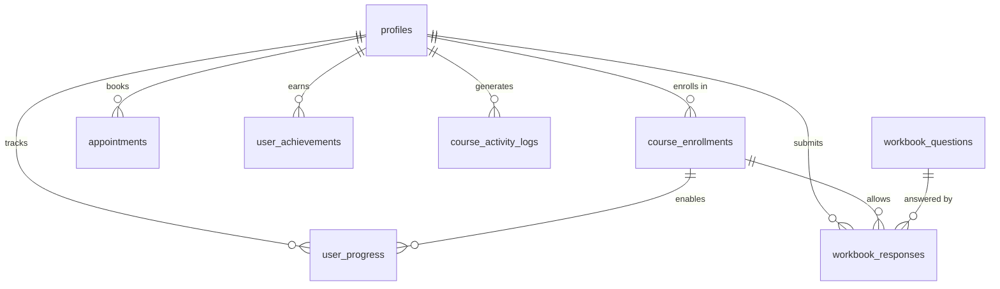

# Bloom Psychology Database Schema Documentation

## Overview
This document outlines the complete database schema required for the Bloom Psychology platform, including all tables, columns, and relationships needed to support the current features.

## Table Schemas

### 1. profiles
User profile information for personalization and contact.

```sql
CREATE TABLE profiles (
  id UUID PRIMARY KEY REFERENCES auth.users(id) ON DELETE CASCADE,
  email TEXT NOT NULL,
  first_name TEXT,
  last_name TEXT,
  phone TEXT,
  postpartum_date DATE,
  number_of_children INTEGER DEFAULT 0,
  emergency_contact_name TEXT,
  emergency_contact_phone TEXT,
  created_at TIMESTAMP WITH TIME ZONE DEFAULT NOW(),
  updated_at TIMESTAMP WITH TIME ZONE DEFAULT NOW()
);

-- Enable RLS
ALTER TABLE profiles ENABLE ROW LEVEL SECURITY;

-- Policies
CREATE POLICY "Users can view own profile" ON profiles
  FOR SELECT USING (auth.uid() = id);

CREATE POLICY "Users can update own profile" ON profiles
  FOR UPDATE USING (auth.uid() = id);

CREATE POLICY "Users can insert own profile" ON profiles
  FOR INSERT WITH CHECK (auth.uid() = id);
```

### 2. course_enrollments
Tracks which courses users have enrolled in.

```sql
CREATE TABLE course_enrollments (
  id UUID PRIMARY KEY DEFAULT gen_random_uuid(),
  user_id UUID NOT NULL REFERENCES auth.users(id) ON DELETE CASCADE,
  course_id TEXT NOT NULL,
  enrolled_at TIMESTAMP WITH TIME ZONE DEFAULT NOW(),
  status TEXT DEFAULT 'active' CHECK (status IN ('active', 'completed', 'cancelled')),
  enrollment_method TEXT DEFAULT 'paid' CHECK (enrollment_method IN ('free', 'paid', 'gifted')),
  amount_paid DECIMAL(10,2) DEFAULT 0,
  stripe_payment_id TEXT,
  completed_at TIMESTAMP WITH TIME ZONE,
  created_at TIMESTAMP WITH TIME ZONE DEFAULT NOW(),
  UNIQUE(user_id, course_id)
);

-- Enable RLS
ALTER TABLE course_enrollments ENABLE ROW LEVEL SECURITY;

-- Policies
CREATE POLICY "Users can view own enrollments" ON course_enrollments
  FOR SELECT USING (auth.uid() = user_id);

CREATE POLICY "Users can insert own enrollments" ON course_enrollments
  FOR INSERT WITH CHECK (auth.uid() = user_id);
```

### 3. user_progress
Tracks lesson completion within courses.

```sql
CREATE TABLE user_progress (
  id UUID PRIMARY KEY DEFAULT gen_random_uuid(),
  user_id UUID NOT NULL REFERENCES auth.users(id) ON DELETE CASCADE,
  course_id TEXT NOT NULL,
  lesson_number INTEGER NOT NULL,
  completed BOOLEAN DEFAULT FALSE,
  completed_at TIMESTAMP WITH TIME ZONE,
  time_spent_minutes INTEGER DEFAULT 0,
  created_at TIMESTAMP WITH TIME ZONE DEFAULT NOW(),
  updated_at TIMESTAMP WITH TIME ZONE DEFAULT NOW(),
  UNIQUE(user_id, course_id, lesson_number)
);

-- Enable RLS
ALTER TABLE user_progress ENABLE ROW LEVEL SECURITY;

-- Policies
CREATE POLICY "Users can view own progress" ON user_progress
  FOR SELECT USING (auth.uid() = user_id);

CREATE POLICY "Users can update own progress" ON user_progress
  FOR ALL USING (auth.uid() = user_id);
```

### 4. workbook_questions
Defines the questions for each course workbook.

```sql
CREATE TABLE workbook_questions (
  id UUID PRIMARY KEY DEFAULT gen_random_uuid(),
  course_id TEXT NOT NULL,
  week_number INTEGER NOT NULL,
  question_number INTEGER NOT NULL,
  question_text TEXT NOT NULL,
  question_type TEXT DEFAULT 'text' CHECK (question_type IN ('text', 'textarea', 'radio', 'checkbox')),
  options JSONB,
  created_at TIMESTAMP WITH TIME ZONE DEFAULT NOW(),
  UNIQUE(course_id, week_number, question_number)
);

-- Enable RLS
ALTER TABLE workbook_questions ENABLE ROW LEVEL SECURITY;

-- Public read access
CREATE POLICY "Anyone can read questions" ON workbook_questions
  FOR SELECT USING (true);
```

### 5. workbook_responses
Stores user responses to workbook questions.

```sql
CREATE TABLE workbook_responses (
  id UUID PRIMARY KEY DEFAULT gen_random_uuid(),
  user_id UUID NOT NULL REFERENCES auth.users(id) ON DELETE CASCADE,
  course_id TEXT NOT NULL,
  week_number INTEGER NOT NULL,
  question_id UUID REFERENCES workbook_questions(id) ON DELETE CASCADE,
  response TEXT,
  is_draft BOOLEAN DEFAULT TRUE,
  is_submitted BOOLEAN DEFAULT FALSE,
  submitted_at TIMESTAMP WITH TIME ZONE,
  created_at TIMESTAMP WITH TIME ZONE DEFAULT NOW(),
  updated_at TIMESTAMP WITH TIME ZONE DEFAULT NOW(),
  UNIQUE(user_id, question_id)
);

-- Enable RLS
ALTER TABLE workbook_responses ENABLE ROW LEVEL SECURITY;

-- Policies
CREATE POLICY "Users can manage own responses" ON workbook_responses
  FOR ALL USING (auth.uid() = user_id);
```

### 6. appointments
Manages user appointments with Dr. Jana.

```sql
CREATE TABLE appointments (
  id UUID PRIMARY KEY DEFAULT gen_random_uuid(),
  user_id UUID NOT NULL REFERENCES auth.users(id) ON DELETE CASCADE,
  appointment_date TIMESTAMP WITH TIME ZONE NOT NULL,
  appointment_type TEXT NOT NULL CHECK (appointment_type IN ('consultation', 'therapy', 'follow-up')),
  status TEXT DEFAULT 'scheduled' CHECK (status IN ('scheduled', 'confirmed', 'completed', 'cancelled')),
  notes TEXT,
  payment_status TEXT DEFAULT 'pending' CHECK (payment_status IN ('pending', 'paid', 'refunded')),
  confirmation_sent BOOLEAN DEFAULT FALSE,
  confirmation_received BOOLEAN DEFAULT FALSE,
  cancelled_at TIMESTAMP WITH TIME ZONE,
  created_at TIMESTAMP WITH TIME ZONE DEFAULT NOW()
);

-- Enable RLS
ALTER TABLE appointments ENABLE ROW LEVEL SECURITY;

-- Policies
CREATE POLICY "Users can manage own appointments" ON appointments
  FOR ALL USING (auth.uid() = user_id);
```

### 7. user_achievements
Tracks achievements/badges earned by users.

```sql
CREATE TABLE user_achievements (
  id UUID PRIMARY KEY DEFAULT gen_random_uuid(),
  user_id UUID NOT NULL REFERENCES auth.users(id) ON DELETE CASCADE,
  achievement_id TEXT NOT NULL,
  type TEXT,
  name TEXT,
  description TEXT,
  icon TEXT,
  points INTEGER DEFAULT 0,
  earned_at TIMESTAMP WITH TIME ZONE DEFAULT NOW(),
  created_at TIMESTAMP WITH TIME ZONE DEFAULT NOW(),
  UNIQUE(user_id, achievement_id)
);

-- Enable RLS
ALTER TABLE user_achievements ENABLE ROW LEVEL SECURITY;

-- Policies
CREATE POLICY "Users can view own achievements" ON user_achievements
  FOR SELECT USING (auth.uid() = user_id);
```

### 8. course_activity_logs
Tracks user activity within courses for analytics.

```sql
CREATE TABLE course_activity_logs (
  id UUID PRIMARY KEY DEFAULT gen_random_uuid(),
  user_id UUID NOT NULL REFERENCES auth.users(id) ON DELETE CASCADE,
  course_id TEXT NOT NULL,
  activity_type TEXT NOT NULL CHECK (activity_type IN ('lesson_view', 'lesson_complete', 'workbook_start', 'workbook_submit')),
  lesson_number INTEGER,
  metadata JSONB,
  created_at TIMESTAMP WITH TIME ZONE DEFAULT NOW()
);

-- Enable RLS
ALTER TABLE course_activity_logs ENABLE ROW LEVEL SECURITY;

-- Policies
CREATE POLICY "Users can view own activity" ON course_activity_logs
  FOR SELECT USING (auth.uid() = user_id);

CREATE POLICY "Users can insert own activity" ON course_activity_logs
  FOR INSERT WITH CHECK (auth.uid() = user_id);
```

### 9. newsletter_signups
Manages newsletter subscriptions.

```sql
CREATE TABLE newsletter_signups (
  id UUID PRIMARY KEY DEFAULT gen_random_uuid(),
  email TEXT NOT NULL UNIQUE,
  name TEXT,
  subscribed BOOLEAN DEFAULT TRUE,
  tags TEXT[],
  created_at TIMESTAMP WITH TIME ZONE DEFAULT NOW(),
  unsubscribed_at TIMESTAMP WITH TIME ZONE
);

-- Enable RLS
ALTER TABLE newsletter_signups ENABLE ROW LEVEL SECURITY;

-- Policies (admin only)
CREATE POLICY "Admins can manage newsletter" ON newsletter_signups
  FOR ALL USING (auth.jwt() ->> 'role' = 'admin');
```

## Indexes for Performance

```sql
-- Profile lookups
CREATE INDEX idx_profiles_user_id ON profiles(id);

-- Course enrollment queries
CREATE INDEX idx_enrollments_user_id ON course_enrollments(user_id);
CREATE INDEX idx_enrollments_course_id ON course_enrollments(course_id);
CREATE INDEX idx_enrollments_status ON course_enrollments(status);

-- Progress tracking
CREATE INDEX idx_progress_user_course ON user_progress(user_id, course_id);
CREATE INDEX idx_progress_completed ON user_progress(completed);

-- Workbook responses
CREATE INDEX idx_workbook_responses_user ON workbook_responses(user_id);
CREATE INDEX idx_workbook_responses_course_week ON workbook_responses(course_id, week_number);

-- Appointments
CREATE INDEX idx_appointments_user ON appointments(user_id);
CREATE INDEX idx_appointments_date ON appointments(appointment_date);
CREATE INDEX idx_appointments_status ON appointments(status);

-- Activity logs
CREATE INDEX idx_activity_logs_user ON course_activity_logs(user_id);
CREATE INDEX idx_activity_logs_course ON course_activity_logs(course_id);
CREATE INDEX idx_activity_logs_created ON course_activity_logs(created_at);
```

## Functions and Triggers

```sql
-- Update timestamp trigger
CREATE OR REPLACE FUNCTION update_updated_at_column()
RETURNS TRIGGER AS $$
BEGIN
  NEW.updated_at = NOW();
  RETURN NEW;
END;
$$ language 'plpgsql';

-- Apply to relevant tables
CREATE TRIGGER update_profiles_updated_at BEFORE UPDATE ON profiles
  FOR EACH ROW EXECUTE FUNCTION update_updated_at_column();

CREATE TRIGGER update_user_progress_updated_at BEFORE UPDATE ON user_progress
  FOR EACH ROW EXECUTE FUNCTION update_updated_at_column();

CREATE TRIGGER update_workbook_responses_updated_at BEFORE UPDATE ON workbook_responses
  FOR EACH ROW EXECUTE FUNCTION update_updated_at_column();

-- Auto-create profile on user signup
CREATE OR REPLACE FUNCTION public.handle_new_user()
RETURNS trigger AS $$
BEGIN
  INSERT INTO public.profiles (id, email, first_name, last_name)
  VALUES (
    new.id,
    new.email,
    new.raw_user_meta_data->>'first_name',
    new.raw_user_meta_data->>'last_name'
  );
  RETURN new;
END;
$$ LANGUAGE plpgsql SECURITY DEFINER;

CREATE TRIGGER on_auth_user_created
  AFTER INSERT ON auth.users
  FOR EACH ROW EXECUTE FUNCTION public.handle_new_user();
```

## Migration Status

Based on the audit, here's what needs to be created or modified:

### ✅ Existing Tables (Need Schema Updates)
- `course_enrollments` - Missing several columns
- `appointments` - Missing several columns  
- `user_achievements` - Exists but may need additional columns

### ❌ Missing Tables (Need Creation)
- `profiles`
- `user_progress`
- `workbook_responses`
- `workbook_questions`
- `course_activity_logs`

### 📋 Action Items
1. Create missing tables using the SQL above
2. Add missing columns to existing tables
3. Set up RLS policies for security
4. Create indexes for performance
5. Set up triggers for automated tasks

## Data Relationships

